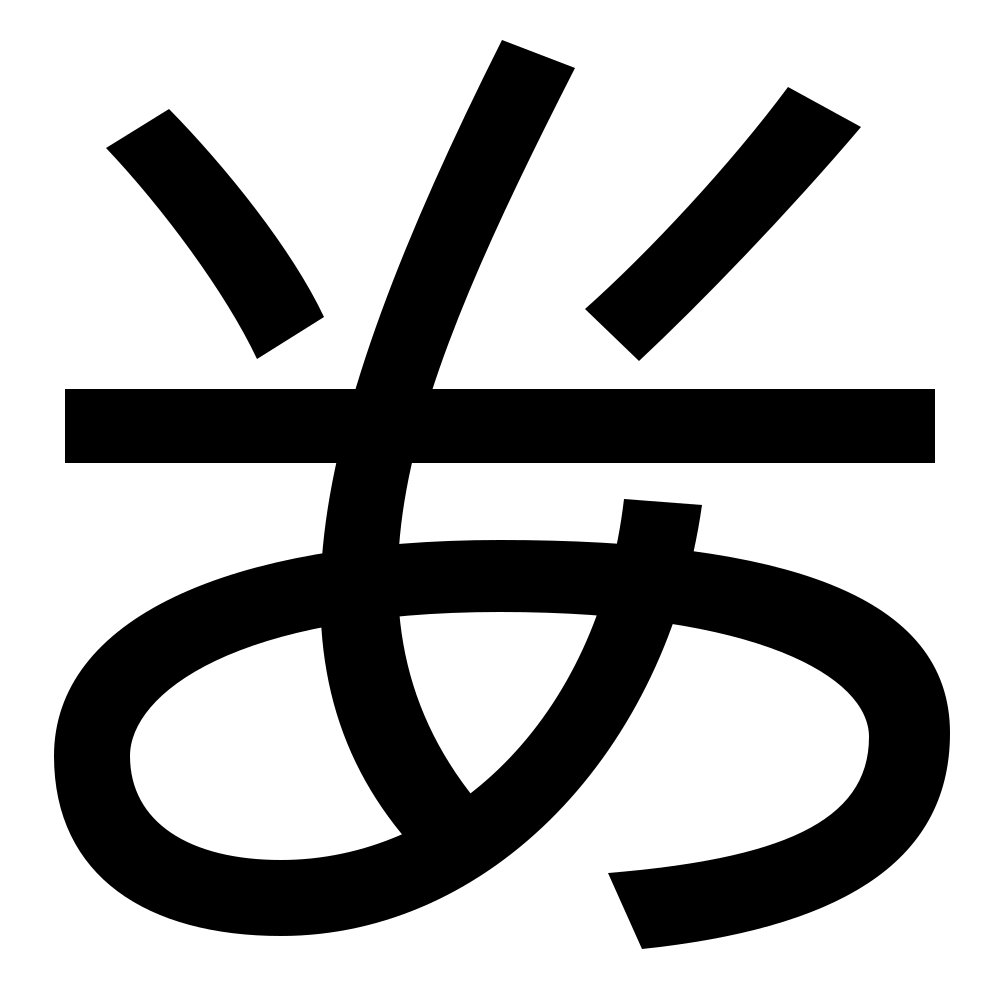

# 字上方的横竖交叉

在汉字当中，经常会有字形由一竖贯穿。这样的字形通常先书写上方的结构，再书写贯穿的竖，最后书写下方的结构。

今天我们学习这类字形中上方的结构，也就是书写竖之前书写的结构。

# 上方的「十」「㐄」「丰」

*“來来”*

*“未”*

*“軍军”*

# 上方的「丅」「干」

*“丁”*
[丁](../src/JingdianCaoshuHeiti-svg/uni4E01.svg)

*“其”*

# 上方的「亻」「千」「牛字头」「午字头」

*“手”*

*“我”*

*“生”*

*“午”*

# 「平字头」「乎字头」「夹字头」「娄字头」「半字头」

*“巠”*

*“妥”*

*“夹”*

*“婁娄”*

*“米”*

这里我们没有提到「⺌」，因为这个部件的笔顺是「竖-点-撇」，并不是最后写竖的。

这种结构中的左右两点经常被简写成一横。

*“平”*

*“炎”*

# 「反犬头」

「反犬头」经常作为「十」或者「犬字头」的简写。

*“求”*

# 「⺊」

*“占”*

# 「弔」

*“弟”*
